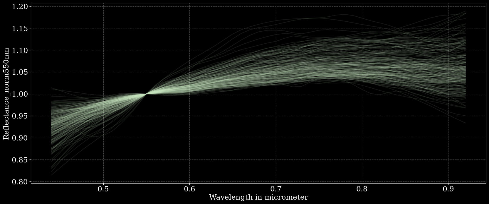
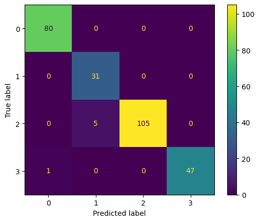
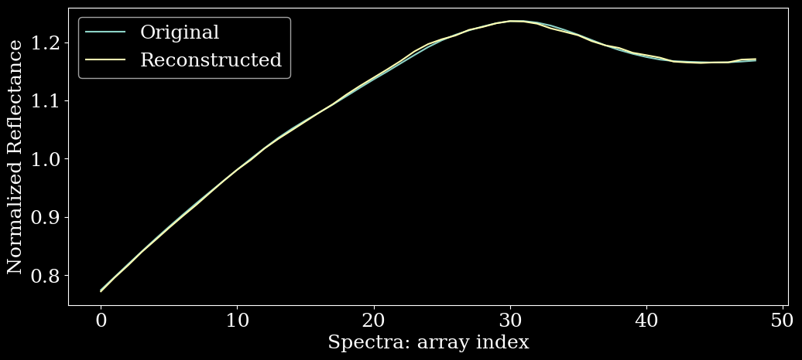

## Description

This is a machine learning project of predicting Asteroids of SMASS survey using multiclass SVM model. Further, we use Gaussian Mixture Models to confirm the presence of non-gaussian datasets. Interactive dashboard to learn about the project under development (stay tuned).

## Data type

Dataset used is Visible wavelength spectroscopy (typically 0.45-0.95 micron) for 1341 asteroids from the second phase of the SMASS survey (SMASS II).

DATA STRUCTURE WITHIN EACH FILE WITHIN SMASS DATA SET [2]

Each file has three tab-separated columns, with the format:
- Column 1: Wavelength (in microns)
- Column 2: Relative reflectance, normalized at 0.55 micron
- Column 3: Uncertainty in the relative reflectance

## Analysis process
Given imbalanced dataset stratified splitting, proper weighing, standard scaling, hyper-tuning using SVM kernel with certain punishment index is used to tackle the problem of Multiclass SVM classification. We considered:
- Column 1: Wavelength (in microns)
- Column 2: Relative reflectance, normalized at 0.55 micron

Producing different metrics and F1_score of 0.98.

Further, Developed an autoencoder for dimensionality reduction on 49 features (wavelength spectral measurements between 440 nm - 920 nm), guided by Bayesian Information Criterion (BIC) for model optimization. Utilized Convolutional Neural Networks, Keras tuner, and early stopping callbacks, with a Gaussian Mixture Model (GMM) to confirm the presence of non-Gaussian distributions in the reduced data for clustering.

HZResults(hz=np.float64(1.0361962918025756), pval=np.float64(0.008876782129987456), normal=False)

## Results

*Figure 0: Graph representing normalization of data Reflectance vs Wavelength*

*Figure 1: Multiple model distribution result in confusion matrix with an F1 score of 0.98*

*Figure 2: Reconstruction signals for one of the many spectra dataset*

## Source

Dataset accessed from [http://smass.mit.edu/smass.html](http://smass.mit.edu/smass.html)

## Future

We will be test other Machine Learning models to make the model more robust and learn what work and what not.